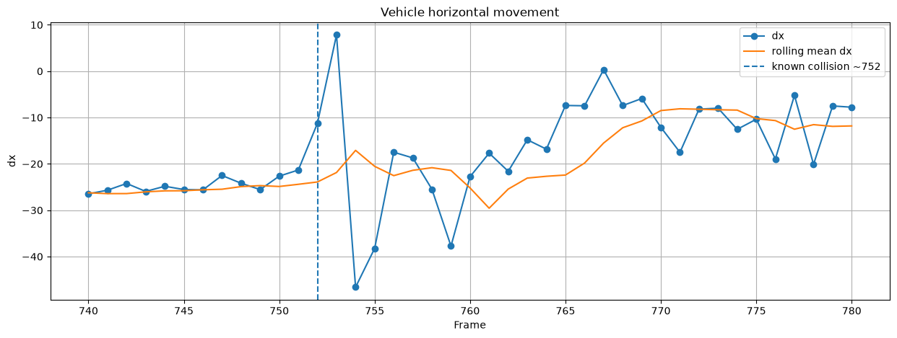
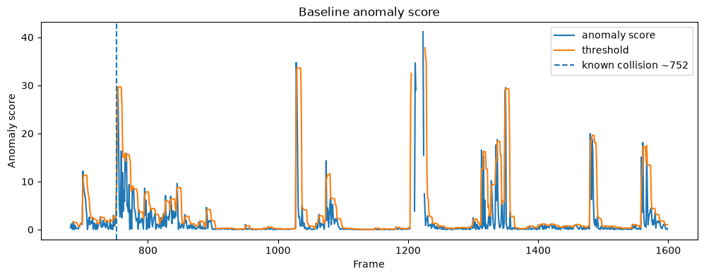
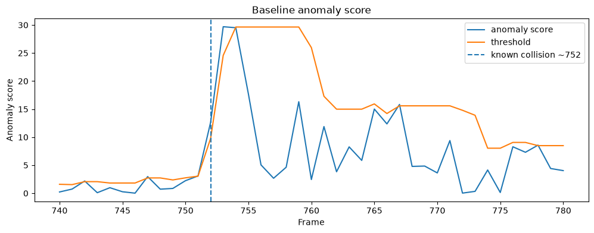
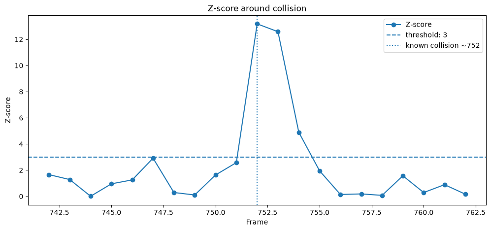

# Vehicle Collision Detection

## Overview

This investigation was conducted to detect vehicle collisions in traffic video. The implemented pipeline is based on detecting anomalous vehicle behavior. Due to unstable detection of the second vehicle involved in the collision, several approaches were investigated to identify the collision from the behavior of a tracked vehicle.

## Approach
1. YOLO detection
2. ByteTrack
3. Track stitching
4. Trajectory extraction
5. Anomaly score
6. Z-score normalization
7. Event detection

## Pipeline
- run YOLO tracking inference in stream mode
- detect vehicles
- track vehicles using ByteTrack
- stitch track IDs into persistent object IDs
- calculate horizontal displacement `dx` (px/frame) between consecutive frames
- calculate the absolute deviation of `dx` from its rolling mean as the anomaly score, using a window size of 7
- calculate the Z-score of the anomaly score using a window size of 30
- detect collision candidates using a Z-score threshold of 3.0 and temporal filtering
- log extracted features
- render processed video frames with detected vehicles, trajectories, and anomaly information

## Project Structure

```
car-collision-detection
├── data
│   ├── input/
│   ├── logs/
│   └── output/
├── models/
├── notebooks/
│   └── analysis.ipynb
├── src/
│   ├── collision/
│   │   ├── anomaly_score.py
│   │   ├── event_detector.py
│   │   ├── threshold_estimator.py
│   │   └── zscore_estimator.py
│   ├── configs/
│   │   └── config.py
│   ├── tracking/
│   │   ├── track_state.py
│   │   └── track_stitcher.py
│   ├── trajectory/
│   │   └── trajectory.py
│   ├── visualization/
│   │   ├── render_state.py
│   │   └── renderer.py
│   └── main.py
├── tests/
├── .gitignore
├── LICENSE
├── poetry.lock
├── pyproject.toml
└── README.md
```

## Installation

### Requirements
Python 3.11+
Poetry
NVIDIA GPU with CUDA support recommended

### Setup

Clone the repository and install the project dependencies:

```bash
git clone https://github.com/Egor-Pavshuk/car-collision-detection
cd car-collision-detection
```
```bash
poetry install

```

Activate the virtual environment:

```bash
poetry shell
```

Or run commands directly through Poetry:

```bash
poetry run python -m src.main
```

### Model

The project uses a YOLO model for vehicle detection and tracking. The model weights are not included in the repository due to their size.

Different YOLO model versions can be used. The required model weights can be downloaded from the [Ultralytics documentation](https://docs.ultralytics.com/tasks/detect).


Place the model weights in the `models/` directory:

```
models/
└── yolo26m.pt
```

The required input video should be placed in `data/input/`

Change the model path in `src/configs/config.py`

```
MODEL_PATH = "models/yolo26m.pt"
```

## Configuration

The main pipeline parameters can be configured in `src/configs/config.py`.

### Model and detection

* `MODEL_PATH` — path to the YOLO model weights.
* `CONFIDENCE` — minimum detection confidence.
* `CLASSES` — object classes used for vehicle detection.

### Tracking

* `TRACKER` — ByteTrack configuration.
* `MAX_FRAME_GAP` — maximum frame gap allowed when stitching track IDs.
* `MAX_CENTER_DISTANCE` — maximum distance between detections for track stitching.
* `MIN_IOU` — minimum IoU required for track stitching.
* `MAX_SIZE_RATIO` — maximum allowed bounding-box size ratio during stitching.

### Trajectory and anomaly detection

* `TRAJECTORY_WINDOW_SIZE` — number of frames used for trajectory statistics.
* `ANOMALY_WINDOW_SIZE` — rolling window size for the horizontal displacement anomaly score.
* `ZSCORE_WINDOW_SIZE` — rolling window size for Z-score normalization.
* `Z_THRESHOLD` — Z-score threshold used to identify anomalous motion.

### Event detection

* `MERGE_GAP` — maximum gap between anomalous frames that can belong to the same event.
* `MIN_CONSECUTIVE_FRAMES` — minimum number of consecutive anomalous frames required to start an event.
* `MIN_BBOX_AREA` — minimum bounding-box dimensions used to filter small detections.

### Output

* `VIDEO_PATH` — input video path.
* `OUTPUT_VIDEO_PATH` — processed video output directory.
* `LOG_TRACKING_PATH` — CSV tracking log path.
* `SAVE_MODEL_OUTPUT` — Boolean value. Configures model save mode.

## Results

### Horizontal displacement



### Anomaly score



### Anomaly score around the collision



### Z-score around the collision



## Limitations

* The collision detection relies primarily on the horizontal displacement of a vehicle between consecutive frames. Since the motion is measured in pixels, the same physical movement can produce different values depending on the vehicle's position in the image.

* The approach is sensitive to tracking errors. Incorrect track associations or ID switches can introduce artificial changes in the vehicle trajectory and produce false positive anomaly events.

* Small and distant vehicles are more difficult to detect and track reliably. Their bounding boxes are more affected by detection noise, which can lead to additional false positives.

* The second vehicle involved in the collision is not consistently detected before the collision. Therefore, the current approach primarily identifies the collision from the anomalous behavior of the first vehicle rather than directly measuring the interaction between two vehicles.

* The anomaly threshold is based on a rolling statistical estimate and the final Z-score threshold is shared across objects. This provides a simple and consistent detection criterion, but does not account for differences in individual vehicle motion patterns.

* The current solution is evaluated on a single collision video, so the selected parameters may not generalize to different cameras, traffic scenes, or collision types.

## Possible Improvements

* Improve vehicle detection and tracking by using a stronger YOLO model or fine-tuning it on traffic and collision-specific data.

* Improve track stitching by using additional information such as object appearance, motion direction, and class consistency to reduce incorrect associations.

* Use multiple motion features instead of relying primarily on horizontal displacement, for example velocity, acceleration, trajectory changes, and vertical displacement.

* Incorporate spatial interaction between vehicles, such as distance between bounding boxes or trajectories, to identify whether two vehicles are approaching or colliding.

* Use a more robust anomaly detection method, such as adaptive or object-specific thresholds, instead of a single threshold for all tracked objects.

* Train a dedicated collision detection model on a larger dataset containing both collision and non-collision traffic events.

* Evaluate the pipeline on multiple videos and camera viewpoints to tune parameters and measure generalization.
